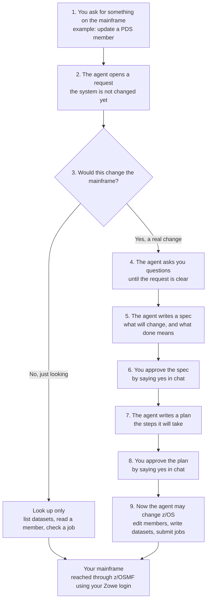

# Mainframe Workflow MCP

An MCP server that lets an AI agent work with your z/OS system **without jumping straight to a live change**.

## Problem → solution

**Problem.** Mainframe edits (PDS members, datasets, job submissions) are hard to undo. If an agent has those tools connected, it can go from a vague request to a mutating API call in one step.

**Solution.** This server is the only mainframe tool surface the agent should connect to. Looking up data is allowed immediately. Anything that would change z/OS is blocked until you have seen a written spec, then a written plan, and said **yes** to both in chat.

A private toolbox (`zcrafter-mainframe-mcp`) still does the actual z/OSMF calls. This project wraps it with a request lifecycle and an audit log.

## How a request flows

Read this top to bottom. You are in the loop at steps 6 and 8; nothing on the mainframe changes before that.



What that means in practice:

- **Looking up data** (list a dataset, read a member, check job output) does not need your approval.
- **Changing the system** always goes through questions → spec → plan. Silence is not approval. The agent must get an explicit yes in the current chat.
- Login secrets come from the Zowe profile already on your machine (Windows Credential Manager, macOS Keychain, or Linux libsecret). They are never stored in this repo.

### What you see in chat


Idle requests are abandoned after **14 days**. Finished or abandoned requests are archived after **90 days**. Both windows are configurable in `.env`.

## Installation

### Prerequisites

- Python 3.11 or newer
- Node.js 20 or newer (for the credential helper, which uses `keytar`)
- A working [Zowe](https://docs.zowe.org/) z/OSMF profile whose secure fields are stored in the OS credential vault
- Reachable z/OSMF
- GitHub access to the private [`sangsang01/Zcrafter`](https://github.com/sangsang01/Zcrafter) repository (the workflow server installs `zcrafter-mainframe-mcp` from that repo)

### 1. Create a virtualenv and install Python deps

Windows:

```bash
python -m venv .venv
.venv\Scripts\pip install -r requirements-dev.txt
```

macOS / Linux:

```bash
python -m venv .venv
source .venv/bin/activate
pip install -r requirements-dev.txt
```

If `pip` cannot clone `zcrafter-mainframe-mcp`, authenticate GitHub for git+https installs first (one-time):

```bash
gh auth setup-git
```

Without that access, the install fails. This server cannot run without the private toolbox.

### 2. Build the credential helper

```bash
cd credential-resolver
npm install
npm run build
cd ..
```

### 3. Configure

```bash
cp .env.example .env
```

On Windows you can use `copy .env.example .env`. Set `MAINFRAME_WORKFLOW_ZOWE_PROFILE` if your Zowe profile is not named `default`.

### 4. Run the server

```bash
python -m mainframe_workflow_mcp.server
```

### 5. Point your MCP host at it

Example (Claude Code / Cursor-style MCP config). Use your venv’s Python, and run from the repo root:

```json
{
  "mcpServers": {
    "mainframe-workflow": {
      "command": "python",
      "args": ["-m", "mainframe_workflow_mcp.server"]
    }
  }
}
```

Also install the companion skill at [`.claude/skills/mainframe-workflow/SKILL.md`](.claude/skills/mainframe-workflow/SKILL.md) so the agent follows the gate instead of calling approve tools on its own.

## Tests

```bash
pytest -v
cd credential-resolver && npm test && cd ..
```

## Known limitation

The credential helper assumes Zowe’s OS-vault account names match what your installed Zowe CLI actually writes. If resolution fails, confirm the service/account strings in `credential-resolver/src/resolver.ts` against your CLI version.

## License

MIT. See [LICENSE](LICENSE).

## Contributing

See [CONTRIBUTING.md](CONTRIBUTING.md) to set up a dev environment, and [docs/architecture.md](docs/architecture.md) for where to look in the code.
